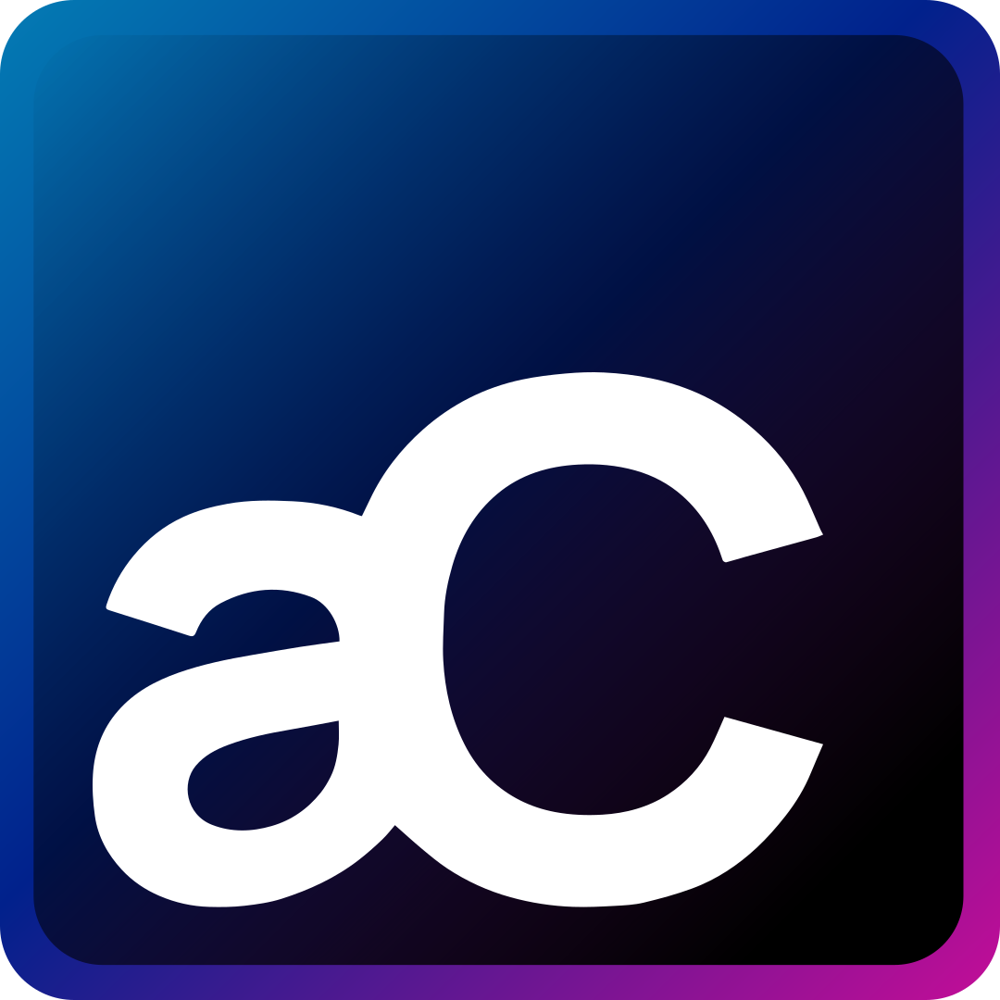

<div align="center">
  
  
  # Andrés Cordero - Portafolio Profesional ✨
  
  **Bienvenido a mi sitio web personal y portafolio interactivo.**  
  Construido con las mejores prácticas de UX/UI, diseño moderno y tecnología de punta.

  [](https://reactjs.org/)
  [](https://vitejs.dev/)
  [](https://tailwindcss.com/)
  [](https://www.typescriptlang.org/)

</div>

---

## 🚀 Sobre este proyecto

Este repositorio contiene el código fuente de mi *landing page* profesional. El objetivo principal de este proyecto es mostrar mi experiencia, habilidades tecnológicas y trayectoria como **Ingeniero de Software especializado en Desarrollo Frontend y Gestión de Proyectos**. 

La interfaz fue rediseñada para ser completamente **Responsiva (Mobile-First)**, garantizando una experiencia de usuario (UX) fluida, moderna y atractiva en cualquier tipo de pantalla.

---

## 👨‍💻 Sobre mí

Soy un apasionado de la tecnología con experiencia en desarrollo web, diseño de interfaces y aseguramiento de calidad (QA). Mi enfoque principal es crear soluciones escalables e interfaces que los usuarios amen utilizar.

🌟 **Puntos Destacados:**
- 🛠️ Desarrollo de aplicaciones web complejas y *landing pages* interactivas.
- 🎨 Implementación de interfaces atractivas con enfoque total en UI/UX.
- ☁️ Gestión de bases de datos y servicios en la nube como AWS.
- 📈 Liderazgo y metodologías ágiles para una entrega de proyectos eficiente.

### 🎓 Formación y Logros

- 🎓 **Ingeniería en Sistemas y Software** | Universidad La Salle Bajío (2020-2024)
- 🏆 **1er Lugar** | Hackathon Mejora Regulatoria 2.0 (Compitiendo contra 30+ equipos).
- 🥈 **2do Lugar** | Reto VW GTO 2.0.
- 🌍 **Expositor** | Proyecto para Volkswagen en la Feria Industrial Hannover Messe.

---

## 🛠️ Stack Tecnológico

El proyecto ha sido desarrollado utilizando las siguientes tecnologías:

* ⚛️ **React + TypeScript**: Para una estructura de componentes sólida, escalable y libre de errores.
* ⚡ **Vite**: Como entorno de desarrollo ultra rápido.
* 🎨 **Tailwind CSS**: Para el diseño visual, estilos flexibles y adaptabilidad responsiva (100% Mobile-Friendly).
* 🎞️ **Framer Motion**: Para las animaciones fluidas y transiciones atractivas a lo largo del sitio.

---

## ⚙️ Instalación y Uso Local

¿Quieres probar el proyecto en tu máquina local? Sigue estos sencillos pasos:

1. **Clona el repositorio:**
   ```bash
   git clone https://github.com/andresxordero/ac-website.git
   ```

2. **Entra al directorio del proyecto:**
   ```bash
   cd ac-website
   ```

3. **Instala las dependencias:**
   Usando Yarn (recomendado):
   ```bash
   yarn install
   ```
   *O si prefieres NPM:*
   ```bash
   npm install
   ```

4. **Inicia el servidor de desarrollo:**
   ```bash
   yarn dev
   ```

5. **Abre tu navegador:**  
   Dirígete a `http://localhost:5173/` y explora el portafolio en vivo.

---

## 📬 Contacto

Si te gusta lo que ves o tienes alguna propuesta de proyecto, no dudes en contactarme:

- 💼 **LinkedIn**: [andresmcorderor](https://www.linkedin.com/in/andresmcorderor/)
- 💻 **GitHub**: [andrescorderor](https://github.com/andrescorderor)

---

<div align="center">
  <sub>Hecho con ❤️ y código limpio.</sub>
</div>
